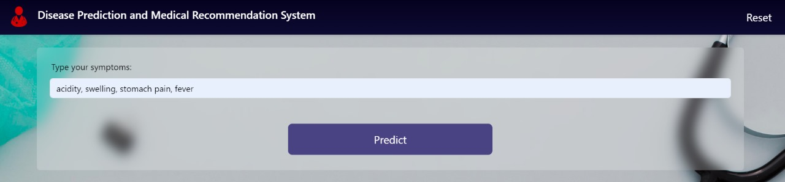
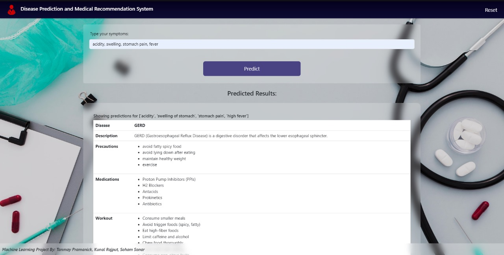
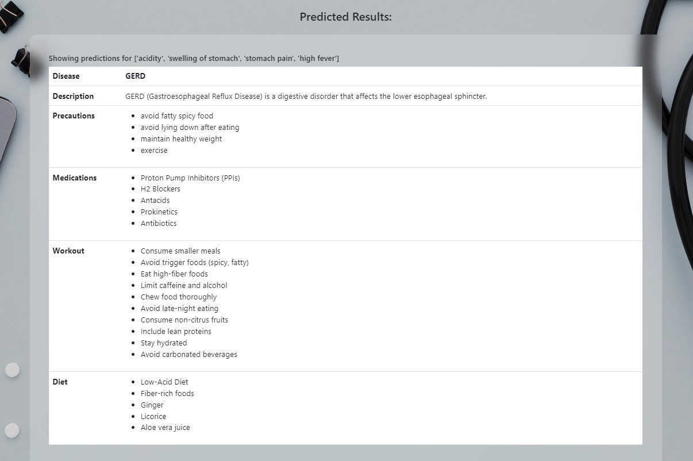

## 🩺 MediPath – Disease Prediction and Medicine Recommendation System**

An AI-powered web application that predicts diseases based on user-input symptoms and recommends appropriate medicines using Machine Learning algorithms such as Decision Tree, SVM, and Random Forest.

**🔍 About the Project**

MediPath is a smart health assistant designed to help users identify possible diseases based on their symptoms and recommend general medicines. This tool serves as a preliminary diagnosis system and enhances healthcare accessibility, especially in remote or underserved areas.

**🚀 Features**

🔎 Disease prediction based on symptoms using trained ML models

💊 Medicine recommendation linked with the predicted disease

📈 Uses multiple ML algorithms for improved accuracy

🔐 Secure and responsive user interface

👨‍⚕️ Doctor/admin panel (optional for dataset management)

**🛠 Tech Stack**

Frontend: HTML, CSS, Bootstrap, JavaScript

Backend: Python, Flask

Database: SQLite / MySQL

Machine Learning: scikit-learn, pandas, NumPy

**🤖 ML Algorithms Used**

Decision Tree: Simple, explainable disease prediction
Support Vector Machine (SVM):	Effective in complex and high-dimensional symptom classification
Random Forest:	Ensemble method for more robust and accurate predictions

**📸 Screenshots**

Symptom Entry Page

Prediction Result Page

Medicine Suggestions

**✅ Current Limitations**
Not personalized for patient history

Limited to general diseases

Static medicine mapping (non-dosage specific)

**🔮 Planned Features**
Integration with wearable health devices

Real-time doctor chat

Multilingual support

Advanced medicine prescription with dosage & interactions

**👥 Contributors**
Anshuman Agarwal

